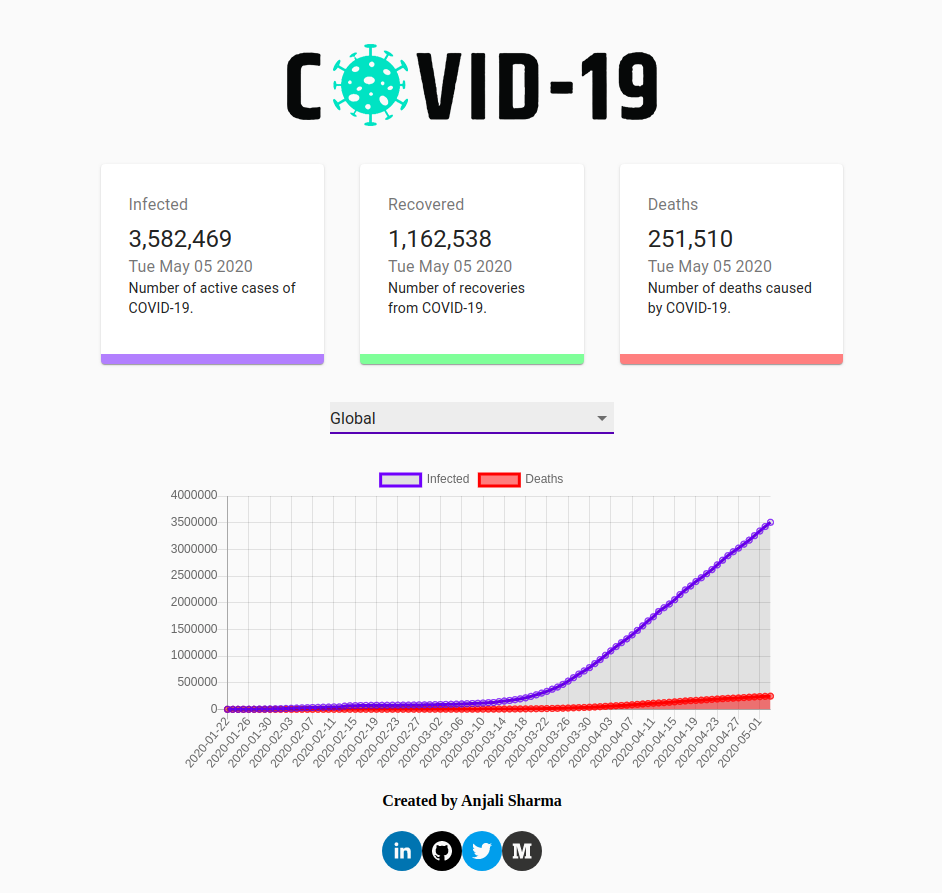

# COVID 19 - Tracker

   

A web app to represent the data of COVID-19 epidemic build with React, Chart.JS and Material UI.

This is motivated and learned from [Javascript Mastery](https://www.youtube.com/watch?v=khJlrj3Y6Ls).

## Tech Stack

- HTML5, CSS3, Javascript, ReactJS, React Hooks, Chart.JS, Material UI
- API used: https://covid19.mathdro.id/api

## Screenshot of the Web App

## Tutorial Blog Post

The following is my tutorial blog post on ["Learn React by building an App — React Functionalities Explained"](https://medium.com/mobile-web-dev/learn-react-by-building-a-to-do-app-react-functionalities-explained-74f466e9396). Follow the instructions, fork this repo and build your COVID 19 Tracker.

## Getting Started

- Fork and clone this repository
- Run `npm i && npm start`

## Project Admin

 

|  |
| :----------------------------------------------------------: |
| **[Anjali Sharma](https://www.linkedin.com/in/anjalisharmaaa/)**  |

  
Personal Portfolio : [anjalisharma.tech](anjalisharma.tech) 

